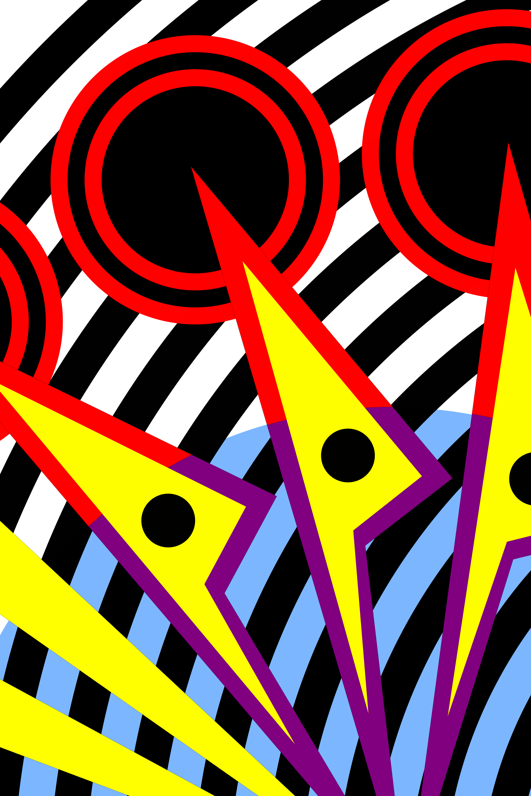
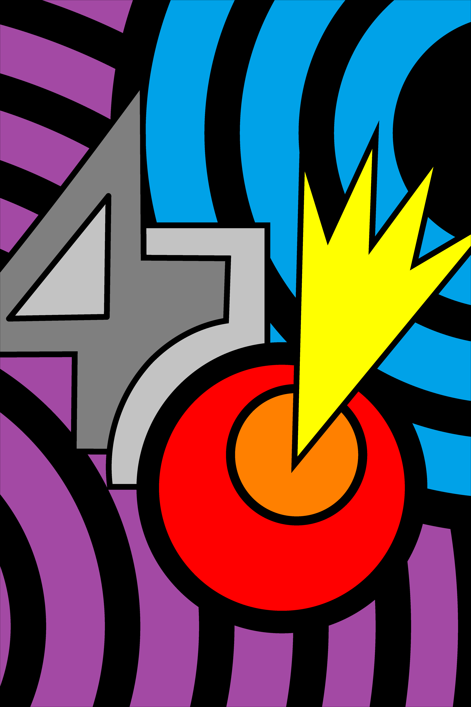
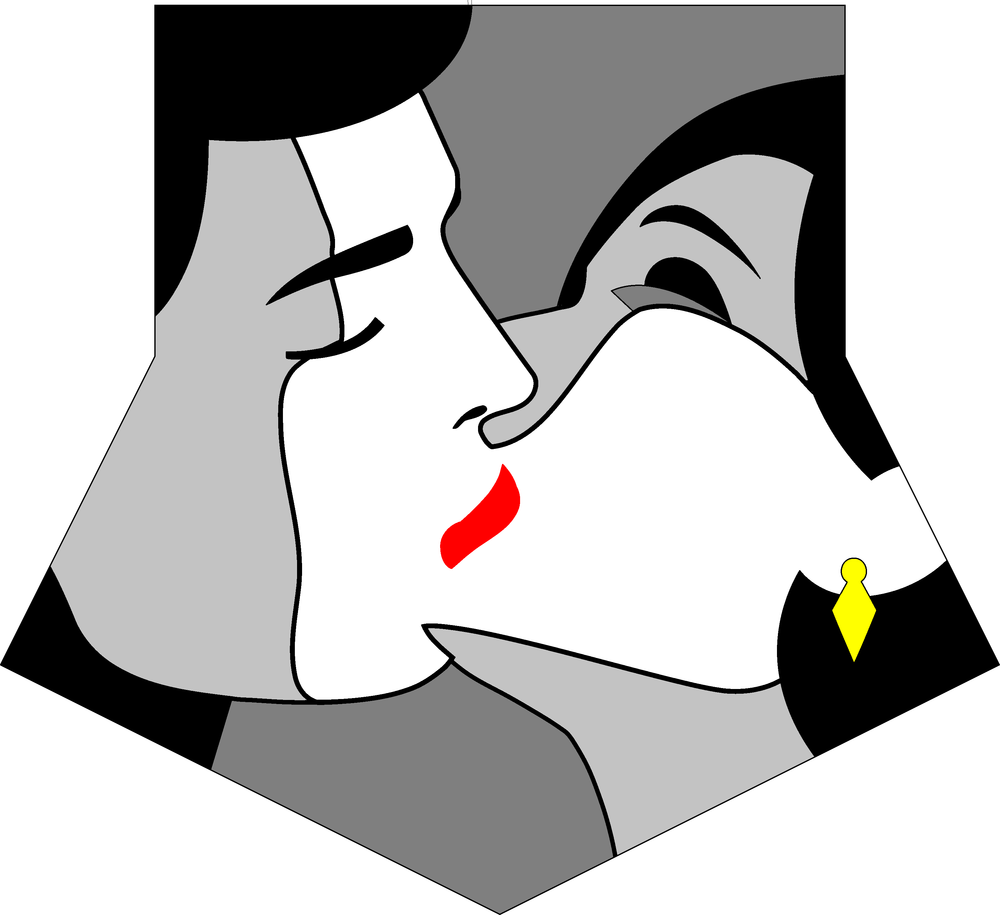
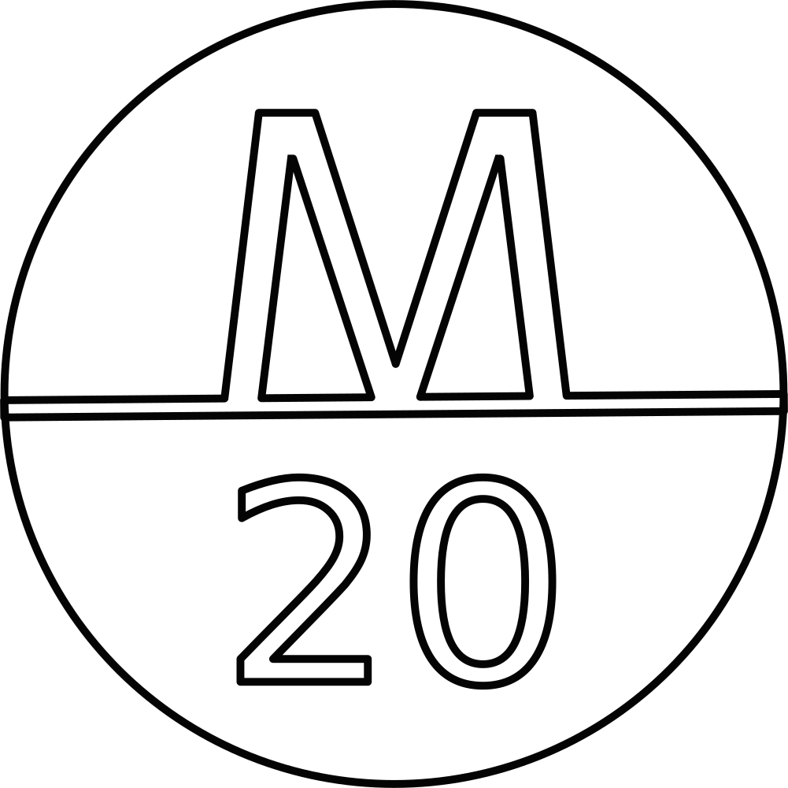

# **Kite Plan Archive**

This is an archive for my self-built kites.

## **Edo-Lito STYLE**

<kbd></kbd> 
&nbsp;&nbsp;&nbsp;&nbsp; 
<kbd></kbd> 
 
## **Suruga STYLE**

<kbd></kbd> 

## **Signatures**

<kbd></kbd>

## **Credits**

Suruga kite graphic is inspired to Malika Favre's works.

## **Contributing**

This code is a tool for my own use. I release it publicly in case people find it useful. It is not however intended as a collaboration/Open Source project. As such I am unlikely to accept PRs, reply to issues, or take requests.

