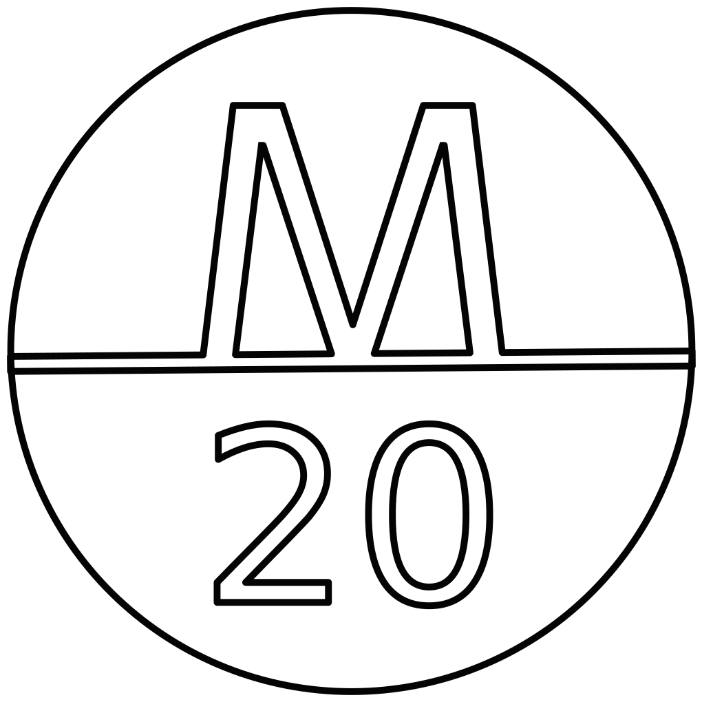

# **Kite Plan Archive**

This is an archive for my self-built kites.

## **Edo-Lito STYLE**

 &nbsp;&nbsp;&nbsp;&nbsp;

## **Signatures**

## **Contributing**

This code is a tool for my own use. I release it publicly in case people find it useful. It is not however intended as a collaboration/Open Source project. As such I am unlikely to accept PRs, reply to issues, or take requests.

